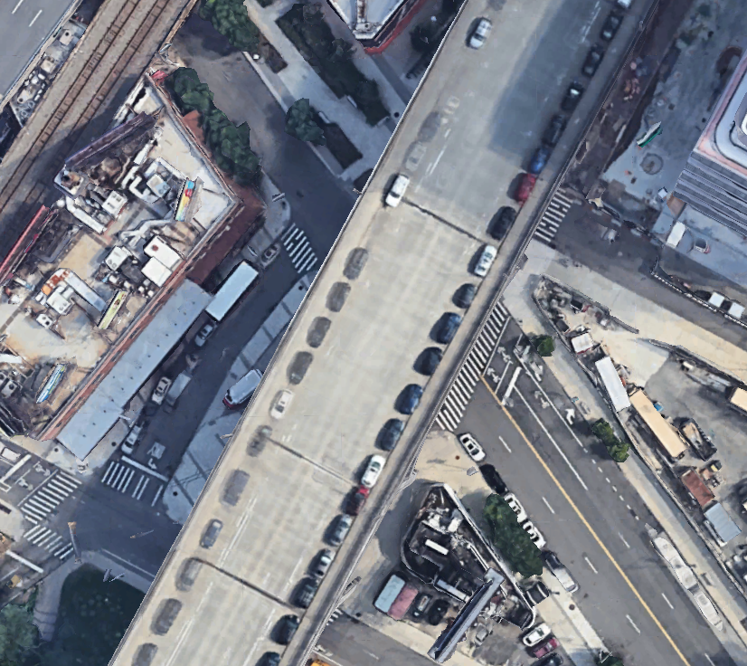

# Don't Give Me That Altitude
_Does Google Maps really provide the best pedestrian directions?_

This project compares walking commute routes to my class at Broadway & 116th, walking on Riverside vs. walking on Broadway. While Google Maps recommends walking Broadway for most of the route, I created path maps in AllTrails to look at changes in elevation as a factor worth considering for both routes.

Here's my story, [Don't Give Me That Altitude: Pedestrian Commuting on Broadway](https://reliablerascal.github.io/commute_hills/), as published on GitHub.

## Key Findings
My key findings are as follows:
<ul>
<li>Riverside (3.6 km) is a slightly longer commute than Broadway (3.5 km) and burns slightly more calories (194 vs. 189).
<li>Constructing a variable "effort" as calories burned divided by distance, Broadway and Riverside are roughly even at 54 calories per kilometer. 
<li>Breaking the walk into three segments based on Broadway's relatively flat stretch through Hamilton (157th to 139th), descent into Manhattanville Valley (139th to 125th), and ascent to Columbia University (125th to 116th)- the Broadway walk gets easier in the second segment and harder in the third segment. Riverside is more even, by comparison.
</ul>

## Data sources
|Data Source|Description|
|---|---|
|[AllTrails](https://alltrails.com)|This free app allows you to create path maps or record them live based on live walking, and then export these maps as GPX files. Because I have no reliable means of controlling my walking pace, I chose to focus on created path maps rather than live walk maps. I excluded walk time as a variable.|
|[Google Earth](https://earth.google.com)|Regardless of whether I walked or recorded my map, AllTrails (and Strava) introduced errors in measuring the altitude of Riverside at sites of bridges over Trinity Cemetery(155th street) and Riverside Viaduct (136th to 129th Street). Google Earth allows lookup of actual height based on pointing and clicking on satellite images.|

## Overview of Data Analysis Process
My data analysis process required the following general steps:
* In AllTrails, created and exported path maps for both Broadway and Riverside commutes
* Exported <a href="./data/commute_broadway_alltrails.gpx" target="_blank">Broadway</a> and <a href="./data/commute_riverside_alltrails.gpx" target="_blank">Riverside</a> path maps as .gpx files
* In Python, converted .gpx files to .csv (latitude, longitude, elevation) to facilitate further analysis
* For each point in the path maps, calculated change in distance, change in height, slope, slope angle, and calories burned as a function of slope angle and change in distance
* Plotted Broadway in Altair to identify inflection points at 139th (downward descent) and 125th (upward climb), tagging each point into segment 1, segment 2, and segment 3 accordingly (see <a href="./notebooks/03_broadway_review_path.ipynb" target="_blank">notebook 3</a>)
* Plotted Riverside in Altair and noticed elevation errors around 155th (over Trinity Cemetery) and 136th (bridge over 12th Avenue)- (see <a href="./notebooks/04_riverside_review_path_and_correct_problems.ipynb" target="_blank">notebook 4</a>).
* Manually created a <a href="./data/commute_riverside_bridge_136.csv" target="_blank">path over the Riverside Viaduct from 136th to 129th</a>.
* Reconstructed the Riverside path in sections- before the Riverside Viaduct, the Riverside Viaduct, and after the Riverside Viaduct. I simply deleted the erroneous readings around 155th because there were only 5 points.
* Calculated summary stats (calories, distance, and effort as calories/distance) for Riverside vs. Broadway by segment

## Data Quirks and Other E-Varmints Standing in My Righteous Path
As mentioned above, erroneous altitude readings on Riverside were problematic and time-consuming to address. My assumption had been that altitude data would be measured/recorded, not looked up from a potentially erroneous (or improperly keyed) data source.

I considered using GeoPandas to look up street addresses, but (aside from running into problems with installation) my sense is that this wouldn't solve the problem because there are no residences or businesses on the Riverside bridges. Ultimately, manually collecting data points in Google Earth for each intersection between 136th and 129th (see picture below)  proved to be the most expedient approach.

## The Trash Bin Runneth Over
I spent several hours thrashing through D3 and Observable and created some nice <a href="./images/d3_accidental_art.png" target="_blank">logic-error art</a> before quickly and easily solving my problems with Altair.

## What I Learned
This project seemed to be a perfect use case for Pandas plus Jupyter Notebooks. Having to iterate through the analysis a half dozen times from start to finish, I needed to have reproducible steps to clean, stitch together, and summarize data quickly.

Adding Altair to my toolkit was key to being able to look up table data (via tooltips) based on a scatterplot of two variables.

I also learned to do some very basic tweaking of a <a href="https://blog.mapbox.com/how-to-build-a-scrollytelling-map-ead6baf2cd1b" target="_blank">Mapbox scrollytelling template</a>, adding my own color scheme.

And, I got some beginner's practice with Adobe Illustrator, to improve SVG graphics showing elevation changes on Broadway and Riverside.

## What I'd Like to Learn Next to Advance this Project
The Mapbox scrollytelling template seems to rely on media queries which handles graphic scaling to some degree. But I might be able to improve this with AI2HTML responsive graphics. Also, I'd like to tailor the template to plot out the walk as a path as in [this example](http://www.formerspatial.com/scrolly-drive).

At some point I may run into the limitations of this template, and want to develop my skill at building scrollytelling from the ground up for more flexibility.

## Guide to the Repository
Following is an overview of files in this repository:
<!---* [source_data](source/data/)- includes only my own manually-entered lookup table for CTA stations--->
* [Jupyter Notebooks](notebooks)- six notebooks following through the data analysis steps from path development to calculating effort
* [data](data/)- raw path data, including the manually-created Riverside Viaduct path
* [results](results/)- results of data analysis
* [images](images/)- pictures and graphs supporting this story

